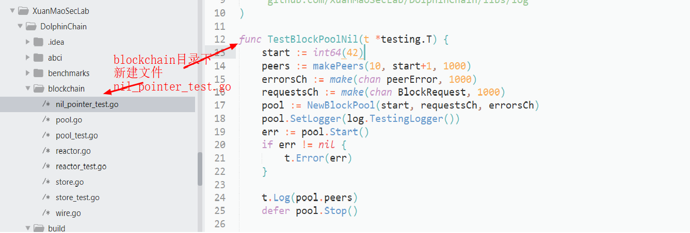
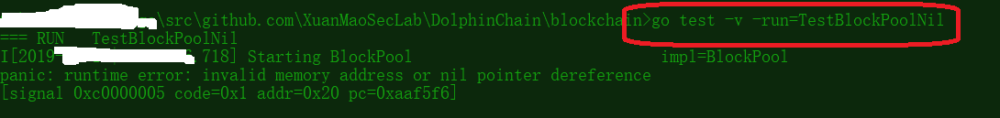
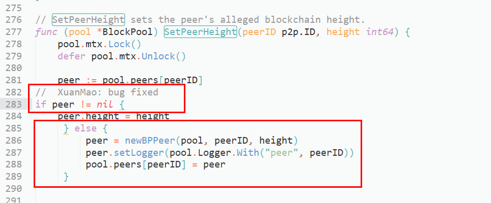

# [DC-03] Nil pointer

## Tag

`nil pointer`;

## Vulnerability description

Crash by Nil Pointer

The nil pointer is not checked properly.

## Vulnerability analysis

File path： `/DolphinChain/blockchain/pool.go`

Vulnerable code:

```golang
// /DolphinChain/blockchain/pool.go
func (pool *BlockPool) SetPeerHeight(peerID p2p.ID, height int64) {
    pool.mtx.Lock()
    defer pool.mtx.Unlock()

    peer := pool.peers[peerID]
    peer.height = height
    if height > pool.maxPeerHeight {
        pool.maxPeerHeight = height
    }
}
```

## Reproduce

Here we use the testing script `nil_pointer_test.go` to test.

[ATTENTION]：Due to the permission of package，this testing script should lie under the directory of `/blockchain`.



### Use go test script to test



```golang
// XuanMao: bug test
// nil_pointer_test.go
package blockchain

import (
    "testing"
    "time"

    "github.com/XuanMaoSecLab/DolphinChain/libs/log"
)

func TestBlockPoolNil(t *testing.T) {
    start := int64(42)
    peers := makePeers(10, start+1, 1000)
    errorsCh := make(chan peerError, 1000)
    requestsCh := make(chan BlockRequest, 1000)
    pool := NewBlockPool(start, requestsCh, errorsCh)
    pool.SetLogger(log.TestingLogger())
    err := pool.Start()
    if err != nil {
        t.Error(err)
    }

    t.Log(pool.peers)
    defer pool.Stop()

    peers.start()
    defer peers.stop()

    // Introduce each peer.
    go func() {
        for _, peer := range peers {
            pool.SetPeerHeight(peer.id, peer.height)//XuanMao: here we will meet crash
        }
    }()

    // Start a goroutine to pull blocks
    go func() {
        for {
            if !pool.IsRunning() {
                return
            }
            first, second := pool.PeekTwoBlocks()
            if first != nil && second != nil {
                pool.PopRequest()
            } else {
                time.Sleep(1 * time.Second)
            }
        }
    }()

    // Pull from channels
    for {
        select {
        case err := <-errorsCh:
            t.Error(err)
        case request := <-requestsCh:
            t.Logf("Pulled new BlockRequest %v", request)
            if request.Height == 300 {
                return // Done!
            }

            peers[request.PeerID].inputChan <- inputData{t, pool, request}
        }
    }
}
```

### Result

```sh
[root@ blockchain]# go test -v -run=TestBlockPoolNil
=== RUN   TestBlockPoolNil
I[2019-03-29|08:56:29.575] Starting BlockPool                           impl=BlockPool
<nil>
panic: runtime error: invalid memory address or nil pointer dereference
[signal SIGSEGV: segmentation violation code=0x1 addr=0x20 pc=0xa625a6]

goroutine 23 [running]:
github.com/XuanMaoSecLab/DolphinChain/blockchain.(*BlockPool).SetPeerHeight(0xc0000c2f00, 0xc0001755c0, 0xc, 0x303)
	/home/Go_work/src/github.com/XuanMaoSecLab/DolphinChain/blockchain/pool.go:284 +0xe6
github.com/XuanMaoSecLab/DolphinChain/blockchain.TestBlockPoolNil.func1(0xc000834570, 0xc0000c2f00)
	/home/Go_work/src/github.com/XuanMaoSecLab/DolphinChain/blockchain/nil_pointer_test.go:31 +0xa7
created by github.com/XuanMaoSecLab/DolphinChain/blockchain.TestBlockPoolNil
	/home/Go_work/src/github.com/XuanMaoSecLab/DolphinChain/blockchain/nil_pointer_test.go:29 +0x3c2
exit status 2
FAIL	github.com/XuanMaoSecLab/DolphinChain/blockchain	0.115s

```

## Fix

Fix method：

Add fixed code in the file `/blockchain/pool.go`



```golang
func (pool *BlockPool) SetPeerHeight(peerID p2p.ID, height int64) {
    pool.mtx.Lock()
    defer pool.mtx.Unlock()

    peer := pool.peers[peerID]
    fmt.Println(peer)
  if peer != nil { // XuanMao: bug fixed
        peer.height = height
  } else { //XuanMao: bug fixed
      peer = newBPPeer(pool, peerID, height)
      peer.setLogger(pool.Logger.With("peer", peerID))
      pool.peers[peerID] = peer
    }

    if height > pool.maxPeerHeight {
        pool.maxPeerHeight = height
    }
}
```

## Reference

You can check related issue [here](https://github.com/tendermint/tendermint/pull/1836/files).
