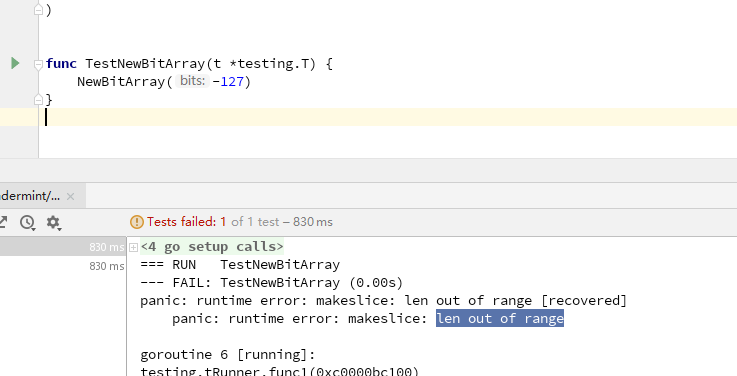
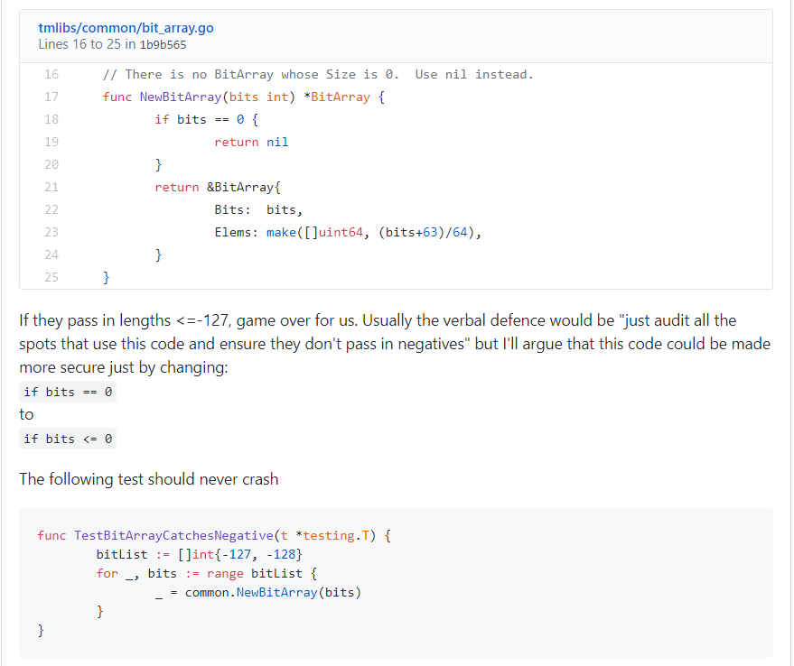

# 1. [DC-07] OOR Due to Improper Check

## 1.1. Tag

`make`

`len out of range`

## 1.2. Vulnerability description

Due to the improper check, malformed value is passed, which leads to `len out of range` when creating an array with `make` method.

## 1.3. Vulnerability analysis

The faulty code is showed below, it only checks the length of array `bit` not equal to 0, but didn't check the negative value of `bits`.

```golang
// There is no BitArray whose Size is 0.  Use nil instead.
func NewBitArray(bits int) *BitArray {
    if bits == 0 {
        return nil
    }
    return &BitArray{
        Bits:  bits,
        Elems: make([]uint64, (bits+63)/64),
    }
}
```

if the malicious node sends the proposal `Total <= -127`, other nodes will crash.

The nature of the problem is `out of range`. Because the check is not complete, not checking the negative value, which leads to the error of make method and crash of nodes.

## 1.4. Reproduce

```go
func TestNewBitArray(t *testing.T) {
    NewBitArray(-127)
}
```



## 1.5. Fix

Reference of this vulnerability: [Fix](https://github.com/tendermint/tendermint/commit/97bdad8262f3da14f17048dc11f095790e07fb02)

when `bits` is less than 0, return `nil`. So it's enough to fix if the `if bits == 0` is modified to `if bits <=0`.



## 1.6. Reference

You can check related issue [here Issue169](https://github.com/tendermint/tmlibs/issues/169)

 [Issue1322](https://github.com/tendermint/tendermint/issues/1322)
