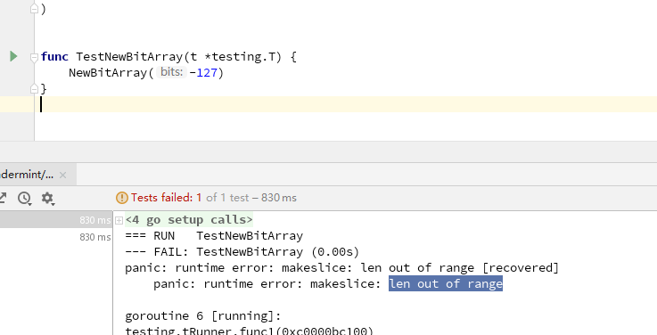
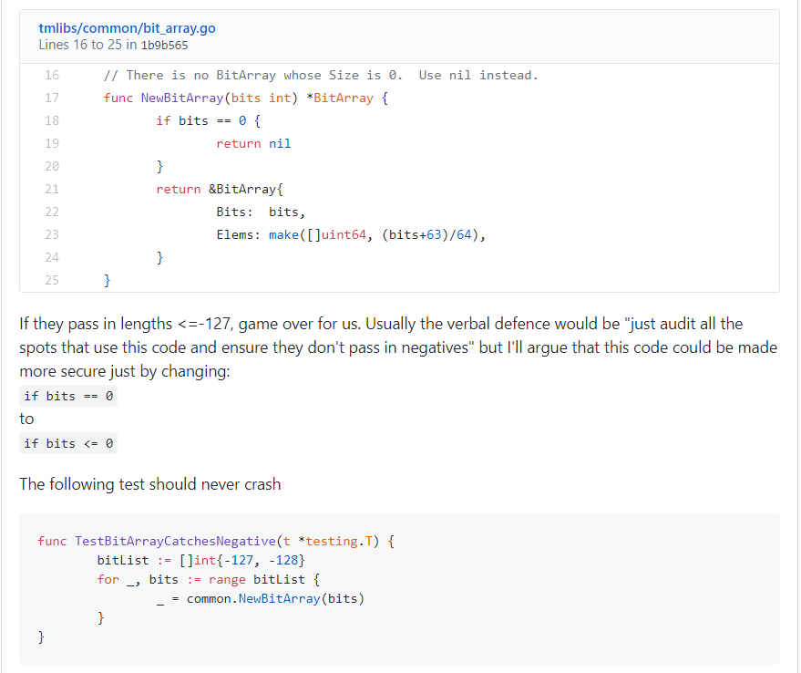

# [DC-07]检查不全导致make方法报错

## 漏洞标签

`make` `len out of range`

## 漏洞描述

检查不全，传入了异常值，可导致 `make` 方法创建数组时 `len out of range`

## 漏洞分析

问题代码如下，bits 只考虑等于0的情况 ，没有考虑小于0的情况。

```golang
// There is no BitArray whose Size is 0.  Use nil instead.
func NewBitArray(bits int) *BitArray {
	if bits == 0 {
		return nil
	}
	return &BitArray{
		Bits:  bits,
		Elems: make([]uint64, (bits+63)/64),
	}
}
```

恶意节点发送`Total <= -127`区块状态的提案，能够让所有其它节点奔溃。

本质是越界的问题，前面对 bits 的判断存在不足，没有判断小于0的情况，导致了 make 的报错crash。

## 复现或测试步骤

```go
func TestNewBitArray(t *testing.T) {
	NewBitArray(-127)
}
```



## 修复

本漏洞相关修复见 : [Fix](https://github.com/tendermint/tendermint/commit/97bdad8262f3da14f17048dc11f095790e07fb02)

当 `bits` 小于0时，返回 `nil`，将 `if bits == 0`修改为`if bits <= 0`。



## 相关资料

本漏洞相关 `Issue` 见 : [Issue169](https://github.com/tendermint/tmlibs/issues/169) [Issue1322](https://github.com/tendermint/tendermint/issues/1322)