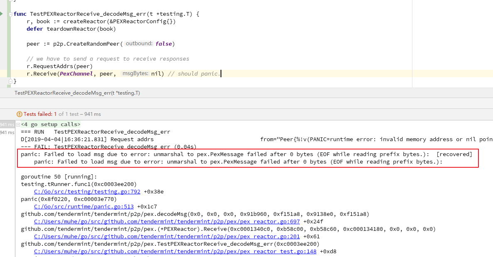

# 1. [DC-09] Crash by Error of P2P DecodeMsg

## 1.1. Tag

`p2p`

`PEX`

`panic`

## 1.2. Vulnerability description

Method `p2p decodeMsg` raises a panic exception, which leads to the crash of the application.

## 1.3. Vulnerability analysis

The exception is not caught and then leads to the crash.

File path：`p2p/pex/pex_reactor.go`

This is the code of function `decodeMsg`, we can see that error will revoke the panic.

```golang
func decodeMsg(bz []byte) (msg PexMessage, err error) {
    if len(bz) > maxMsgSize {
        return msg, fmt.Errorf("Msg exceeds max size (%d > %d)", len(bz), maxMsgSize)
    }
    if err = cdc.UnmarshalBinaryBare(bz, &msg); err != nil {
        panic(fmt.Sprintf("Failed to load msg due to error: %v", err))
    }
    return
}
```

Here `cdc.UnmarshalBinaryBare(bz, &msg)` will parse `bz`. when the error is returned, `panic` is used to handle the error. However, when `panic` is passed to the upper layer, the upper layer doesn't use `recover` to catch this exception, which leads to the crash.

## 1.4. Reproduce

Add the test function below into the file `p2p/pex/pex_reactor_test.go`

And run the command `go test -v -run=TestPEXReactorReceive_decodeMsg_err` in the terminal.

```go

func TestPEXReactorReceive_decodeMsg_err(t *testing.T) {
    r, book := createReactor(&PEXReactorConfig{})
    defer teardownReactor(book)

    peer := p2p.CreateRandomPeer(false)

    // we have to send a request to receive responses
    r.RequestAddrs(peer)
    r.Receive(PexChannel, peer, nil) // should panic.

}
```



We can see that when the node accepts and parse `nil`, `panic` occurs and the node crashes.

## 1.5. Fix

The exception handler of `Go` is `panic` or `error` in general.

In the exception mechanism of `go`, `panic` can stop the original control flow, and switch to a `panic` process. The `panic` process can be revoked by calling `panic` function explicitly or be produced from run time error(like access the non-exist array index). `panic` will be passed to its upper layer and the function who calls it, if no `recover` catches it, the program will crash after exiting. If `panic` is caught by a `defer recover`, the control flow will switch to the recovery routine.

There is an error handler in the upper layer here, therefore `error` should be returned.

```go
func (r *PEXReactor) Receive(chID byte, src Peer, msgBytes []byte) {
    msg, err := decodeMsg(msgBytes)
    if err != nil {
        r.Logger.Error("Error decoding message", "src", src, "chId", chID, "msg", msg, "err", err, "bytes", msgBytes)
        r.Switch.StopPeerForError(src, err)
        return
    }
    // code ...
}

// code ...

func decodeMsg(bz []byte) (msg PexMessage, err error) {
    if len(bz) > maxMsgSize {
        return msg, fmt.Errorf("Msg exceeds max size (%d > %d)", len(bz), maxMsgSize)
    }
    err = cdc.UnmarshalBinaryBare(bz, &msg)
    return
}
```

## 1.6. Reference

You can check the related issue : [Issue813](https://github.com/tendermint/tendermint/issues/813)

You can check the related issue : [Issue816](https://github.com/tendermint/tendermint/issues/816)

You can check the related issue :[Issue817](https://github.com/tendermint/tendermint/issues/817)
