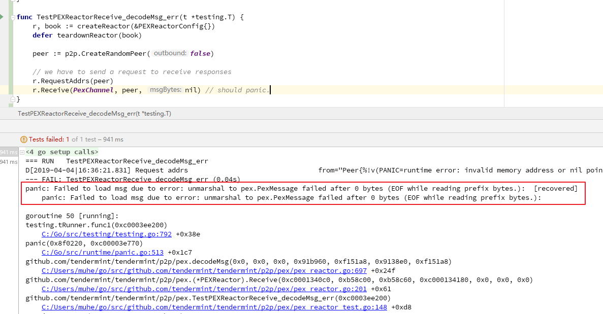

# 1. [DC-09] p2p decodeMsg 错误导致崩溃

## 1.1. 漏洞标签

`p2p` `PEX` `panic`

## 1.2. 漏洞描述

p2p decodeMsg 方法中抛出一个panic的异常，可导致应用崩溃。

## 1.3. 漏洞分析

在 decodeMsg 未捕捉错误，导致崩溃。

文件：`p2p/pex/pex_reactor.go`

`decodeMsg`函数，可以看到如下，有 `panic` 触发报错。

```golang
func decodeMsg(bz []byte) (msg PexMessage, err error) {
	if len(bz) > maxMsgSize {
		return msg, fmt.Errorf("Msg exceeds max size (%d > %d)", len(bz), maxMsgSize)
	}
	if err = cdc.UnmarshalBinaryBare(bz, &msg); err != nil {
		panic(fmt.Sprintf("Failed to load msg due to error: %v", err))
	}
	return
}
```

这里当`cdc.UnmarshalBinaryBare(bz, &msg)`对`bz`进行解析返回错误时，使用 `panic` 进行处理，而 `panic` 错误向上层传递，上层均没有使用 `recover` 捕获这个异常，导致此处可造成崩溃。

## 1.4. 复现或测试步骤

在文件 `p2p/pex/pex_reactor_test.go` 下添加如下测试函数：

并在终端运行`go test -v -run=TestPEXReactorReceive_decodeMsg_err`

```go

func TestPEXReactorReceive_decodeMsg_err(t *testing.T) {
	r, book := createReactor(&PEXReactorConfig{})
	defer teardownReactor(book)

	peer := p2p.CreateRandomPeer(false)

	// we have to send a request to receive responses
	r.RequestAddrs(peer)
	r.Receive(PexChannel, peer, nil) // should panic.

}
```



可以看到当节点接收并解析 `nil` 消息时，发生 `panic` 并 `crash`。

## 1.5. 修复

Go 的异常处理一般为 panic 或 error 。

在go的异常机制中， `panic` 可以将原有的控制流程中断，进入到一个"恐慌"流程。这种恐慌流程可以显式调用`panic()`函数产生或者由运行时错误产生（例如访问越界的数组下标）。panic会在调用它的函数中向本层和它的所有上层逐级抛出，若一直没有 `recover` 将其捕获，程序退出后会产生 `crash` ；若在某层defer语句中被 `recover` 捕获，控制流程将进入到 `recover` 之后的语句中。

而这里因为上层有 error 处理，所以这里应该让其返回 error ，到上层 `Receive` 处理。

```go
func (r *PEXReactor) Receive(chID byte, src Peer, msgBytes []byte) {
	msg, err := decodeMsg(msgBytes)
	if err != nil {
		r.Logger.Error("Error decoding message", "src", src, "chId", chID, "msg", msg, "err", err, "bytes", msgBytes)
		r.Switch.StopPeerForError(src, err)
		return
    }
    // code ...
}

// code ...

func decodeMsg(bz []byte) (msg PexMessage, err error) {
	if len(bz) > maxMsgSize {
		return msg, fmt.Errorf("Msg exceeds max size (%d > %d)", len(bz), maxMsgSize)
	}
	err = cdc.UnmarshalBinaryBare(bz, &msg)
	return
}
```

## 1.6. 相关资料

本漏洞相关 `Issue` 见 : [Issue813](https://github.com/tendermint/tendermint/issues/813)

本漏洞相关 `Issue` 见 : [Issue816](https://github.com/tendermint/tendermint/issues/816)

本漏洞相关 `Issue` 见 : [Issue817](https://github.com/tendermint/tendermint/issues/817)
