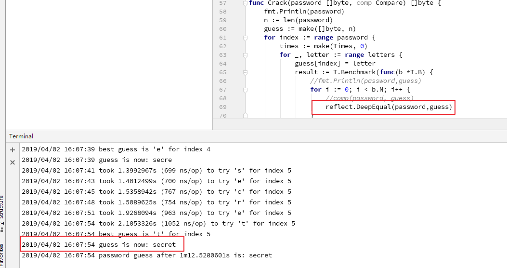
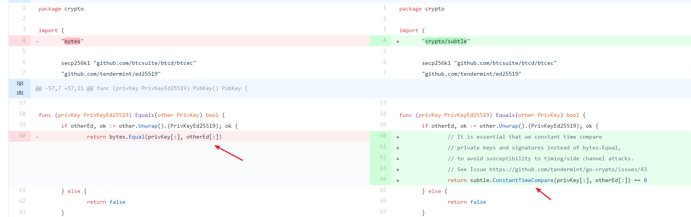

# 1. [DC-10]敏感信息比较时的时序攻击

## 1.1. 漏洞标签

`crypt` `information leak`

## 1.2. 漏洞描述

时序攻击(timing/side channel attacks)，

Go语言中，如果 `byte` `slice` 中含有验证用户身份的数据（密文哈希、`token` 等），不应再使用 `reflect.DeepEqual()`、`bytes.Equal()`、 `bytes.Compare()`、`bytes.EqualFold()`。这三个函数容易对程序造成 `timing attacks`，此时应使用 `crypto/subtle` 包中的 `subtle.ConstantTimeCompare()` 等函数。

## 1.3. 漏洞分析

文件位置： `crypto/ed25519/ed25519.go`

```go
func (privKey PrivKeyEd25519) Equals(other crypto.PrivKey) bool {
	if otherEd, ok := other.(PrivKeyEd25519); ok {
		return reflect.DeepEqual(privKey[:], otherEd[:])
	} else {
		return false
	}
}
```

因为 `reflect.DeepEqual` 的运算时间与字符内容有关，会有被时序攻击的危险，因此这里换用 `subtle.ConstantTimeCompare`, 让 `private key` 和 `signature` 的比较时间一致。

>`func ConstantTimeCompare(x, y []byte) int` 当且仅当两个切片x和y具有相等的内容时，ConstantTimeCompare 返回1。所花费的时间是切片长度的函数，并且与内容无关。

## 1.4. 复现或测试步骤

此处单独针对函数进行测试

```go
package main

import (
	"container/heap"
	"flag"
	"fmt"
	"log"
	"reflect"
	T "testing"
	"time"
)

var (
	password = flag.String("password", "secret", "The password to try and guess")
	letters  = []byte("abcdefghijklmnopqrstuvwxyz")
)

type TestRun struct {
	Time int64
	Byte byte
}

type Times []TestRun

func (t Times) Len() int           { return len(t) }
func (t Times) Less(i, j int) bool { return t[i].Time > t[j].Time }
func (t Times) Swap(i, j int)      { t[i], t[j] = t[j], t[i] }

func (t *Times) Push(v interface{}) {
	*t = append(*t, v.(TestRun))
}

func (t *Times) Pop() interface{} {
	a := *t
	n := len(a)
	v := a[n-1]
	*t = a[0 : n-1]
	return v
}

func Crack(password []byte) []byte {
	fmt.Println(password)
	n := len(password)
	guess := make([]byte, n)
	for index := range password {
		times := make(Times, 0)
		for _, letter := range letters {
			guess[index] = letter
			result := T.Benchmark(func(b *T.B) {
				for i := 0; i < b.N; i++ {
					// use reflect.DeepEqual() here
					reflect.DeepEqual(password,guess)
				}
			})
			heap.Push(&times, TestRun{
				Time: result.NsPerOp(),
				Byte: letter,
			})
			log.Printf("took %s (%d ns/op) to try %q for index %d", result.T, result.NsPerOp(), letter, index)
		}
		tr := heap.Pop(&times).(TestRun)
		guess[index] = tr.Byte
		log.Printf("best guess is %q for index %d", tr.Byte, index)
		log.Printf("guess is now: %s", guess)
	}
	return guess
}


func main() {
	flag.Parse()
	var guess []byte
	pw := []byte(*password)
	start := time.Now()
	Crack(pw)
	end := time.Now()
	dur := end.Sub(start)
	log.Printf("password guess after %s is: %s", dur, guess)
}

```

执行 `go run timing_attack.go`



可以看到通过时序攻击，获取到敏感信息 `secret`。

## 1.5. 修复

将 `reflect.DeepEqual` 替换成 `subtle.ConstantTimeCompare`。

本漏洞相关修复见 : [Fix](https://github.com/tendermint/tendermint/commit/3df2ca128d12a20c63fb05fd20d37132b7576760)

(注：本漏洞制作与原漏洞位置有所不同)



## 1.6. 相关资料

本漏洞相关 `Issue` 见 : [Issue](https://github.com/tendermint/tendermint/issues/2049)

漏洞代码: [链接](https://github.com/tendermint/tendermint/blob/v0.22.5/rpc/core/blocks.go)